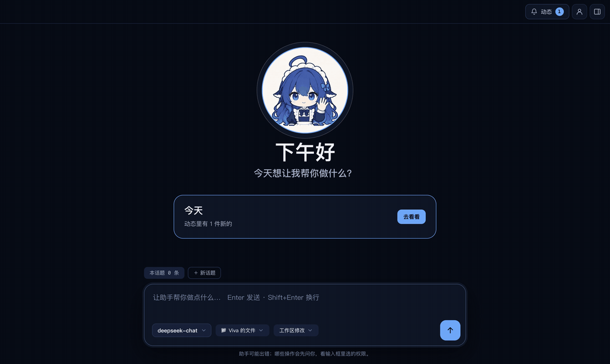
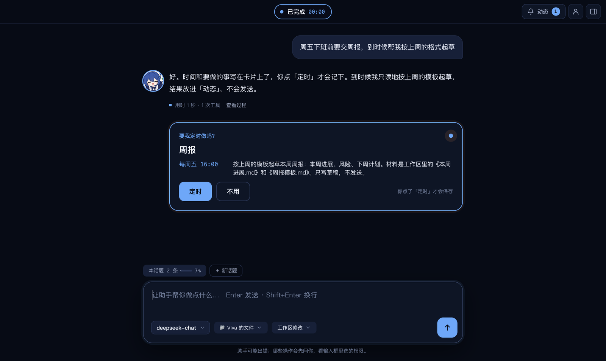
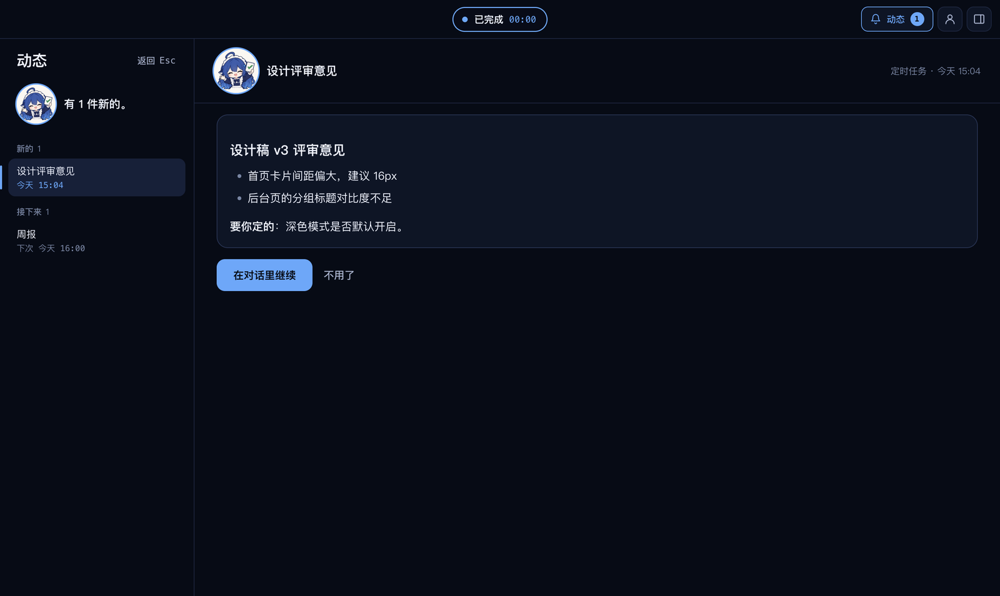
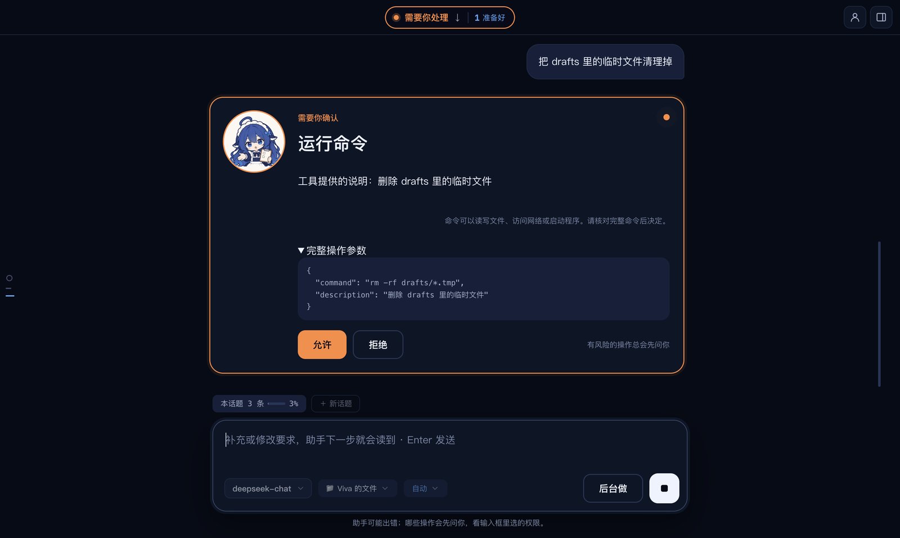
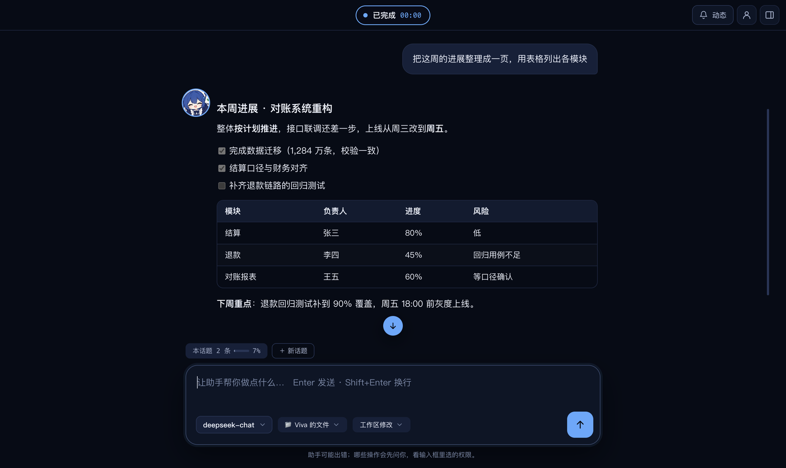
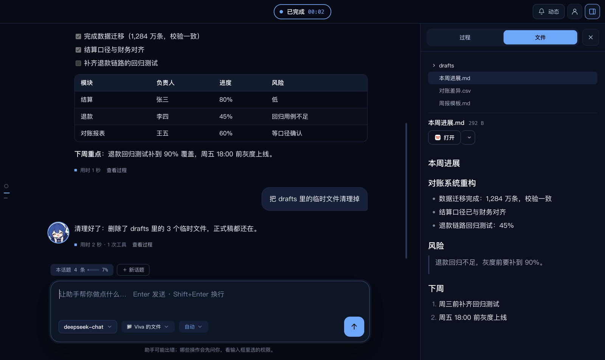
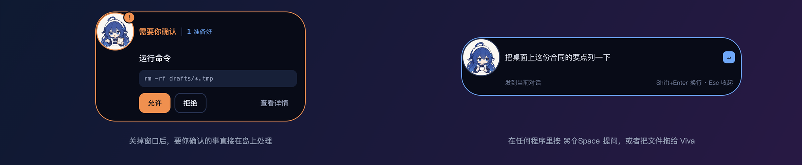
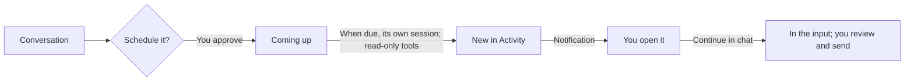

<div align="center">


# Viva

**A desktop AI assistant that follows up.**<br>
It remembers what you mention, does it when it is due and brings the result to Activity, and asks before taking action.

[English](README.md) · [简体中文](README.zh-CN.md)

[](https://github.com/JNS0724/Viva/releases)
[](https://github.com/JNS0724/Viva/actions/workflows/check.yml)
[](#download-and-install)
[](LICENSE)

[Download](https://github.com/JNS0724/Viva/releases) · [Features](docs/features.md) · [Development](docs/development.md)



<sub>Real app recording: ask → review a schedule → approve → it runs when due and lands in Activity → continue in chat.</sub>
</div>

> Viva is a personal project, not an official DeepSeek product. It uses the open-source [DeepSeek Harness](https://github.com/deepseek-ai/deepseek-harness) (dsh). Connect DeepSeek or models with OpenAI-compatible or Anthropic-compatible APIs.
>
> Existing demonstration images show the Chinese interface. Settings → Language changes the interface independently of your conversation language.

## Why Viva?

Most assistants wait for a request. Work often requires remembering things you mention and then forget: “the weekly report is due Friday” or “the contract expires tomorrow.”

- **Proactive:** hears what you will need later in a conversation, then asks whether to schedule it.
- **Within your boundaries:** schedules only what you approve. A scheduled run can look things up but not change anything; you send emails and messages yourself.
- **Just ask:** schedule, change, pause, or delete by saying so in the conversation.

## Highlights

### Shall I schedule it?

Say “My weekly report is due before I leave on Friday; help me draft it then.” The model writes what to do as a prompt, and a card shows when it runs and what it will do. Nothing is saved until you click **Schedule**. Times can be once, daily, weekly, or cron. To change, pause, or delete one later, just say so in the conversation.

| Review the proposal | What came back |
|---|---|
|  |  |

### Runs read-only when due, results in Activity

When it is due, the prompt runs in a session of its own that may **only use look-up tools**, on files in the workspace only. Whatever permission level you picked, writing files, running commands, and sending messages are refused, without asking you, since nobody is there. The answer becomes an item in Activity, with a notification; the Activity button in the title bar counts what is new. Runs missed while the computer slept or Viva was closed happen at the next launch, once per due time.

Activity is separate from Background: Background holds the tasks you hand over; Activity holds what the app brings on its own.

### Review actions before they run

Confirmation cards explain actions that require approval. Choose **Read only**, **Workspace write**, **Automatic**, or **Full access** beside the input. The selected level determines when approval is required. Thoughts and tool calls appear in Activity.



### Conversations, files, and the desktop island

| Markdown conversations | File previews |
|---|---|
|  |  |

Closing the window leaves Viva in the tray. The desktop island shows work and approvals; the tray menu counts what is new in Activity. Press `⌘⇧Space` on macOS or `Ctrl+Shift+Space` on Windows from any app to ask a question, or drop files onto her.



### More

- **Today:** the home page's Today card counts what is new in Activity and the schedules still to run today; click it to open Activity.
- **Remember you:** say “Remember…” or let Viva learn in conversation. View, edit, delete, or restore memories in About you.
- **Connect tools through conversation:** ask to connect GitHub or save a workflow as a skill. Secrets go in a dedicated card, are encrypted locally, and are not given to the model.
- **Ask when uncertain:** if a missing detail changes the answer, the assistant asks instead of guessing.
- **History:** full-text search, pins, Markdown export, and continuation of earlier conversations.

## How it works


```mermaid
flowchart LR
  A["Conversation"] --> P{"Schedule it?"}
  P -->|You approve| S["Coming up"]
  S -->|When due, its own session; read-only tools| R["New in Activity"]
  R -->|Notification| N["You open it"]
  N -->|Continue in chat| C["In the input; you review and send"]
```

Embedded dsh powers conversations over ACP. It runs as a child of Viva's backend process, which keeps the history, background tasks and schedules; the Electron main process only handles the desktop. Memory, permissions and the tools the model uses for tasks and schedules are dsh plugins; Viva does not modify dsh. Schedule times use dsh's `dsh-schedule`. See [System design](docs/system-design.md) and [Features](docs/features.md).

<a id="下载安装"></a>
## Download and install

Download from [Releases](https://github.com/JNS0724/Viva/releases):

| Platform | File |
|---|---|
| macOS (Apple silicon) | `Viva-x.y.z-mac-arm64.dmg` |
| Windows (x64) | `Viva-x.y.z-win-x64-setup.exe` |

Installers are unsigned. First launch may require an extra step:

- **macOS:** drag Viva to Applications, then right-click → Open → Open. If reported as damaged, run `xattr -dr com.apple.quarantine /Applications/Viva.app` in Terminal.
- **Windows:** if “Windows protected your PC” appears, choose More info → Run anyway.

## Quick start

1. Open Connect a model and enter a [DeepSeek API key](https://platform.deepseek.com/api_keys), or add another provider in Settings.
2. Ask for help, such as summarizing weekly reports. Review approval cards before allowing actions.
3. Mention a future task and click **Schedule** on its card. When it is due, the result appears in Activity.
5. Choose Follow system, 简体中文, or English in Settings → Language. Existing profiles retain Chinese on upgrade. Switching language does not translate history or restart the assistant.

## Privacy and safety

- **Encrypted keys:** macOS Keychain or Windows DPAPI encrypts keys locally; the UI shows only the last four characters.
- **Draft, never send:** sending email or messages is blocked; you send the prepared content yourself.
- **Read-only schedules:** a scheduled run may only use look-up tools on workspace files; everything else is refused.
- **Local data:** conversations, memories, schedules, and Activity stay locally. Viva has no server. Model calls, network tools, and connected services use the network. Conversation history is plaintext locally.

## Run from source

Requires Node.js:

```bash
npm install
npm start                # Start the app
npm test                 # Unit and integration tests
npm run smoke            # Real Electron workflow checks
npm run smoke:language   # Language and desktop-island checks
npm run showcase         # Recreate README captures (requires ffmpeg)
```

See [Development](docs/development.md) for packaging, tests and embedded dsh.

## Documentation

- [Features](docs/features.md)
- [Development, packaging, and testing](docs/development.md)
- [System design](docs/system-design.md): the shell and backend processes, the event core, storage, plugins, security and lifecycle
- [UI guidelines](docs/ui-guidelines.md)
- [Live checks before a release](docs/live-check.md)

## Contributing

Report issues or suggest ideas in [Issues](https://github.com/JNS0724/Viva/issues). Before a PR, run `npm run typecheck`, `npm test`, and `npm run smoke`. PR checks run on macOS and Windows.

## License

Viva is [MIT-licensed](LICENSE). Bundled third-party software retains its own licenses, mostly MIT, Apache-2.0, BSD, or ISC. DeepSeek Harness is MIT-licensed. `THIRD_PARTY_NOTICES.txt`, included in the app and each release, lists licenses and source locations:

- **Electron and Chromium:** `LICENSE.electron.txt` and `LICENSES.chromium.html` ship with the app.
- **LibreOffice (MPL-2.0):** notices identify the repository and revision; patches ship with the package.
- **libvips (LGPL-3.0):** a replaceable dynamic library; notices identify its version and source.

You can also request sources through [Issues](https://github.com/JNS0724/Viva/issues).

## Internationalization

Choose Follow system, Simplified Chinese, or English in Settings → Language. New profiles follow the system; existing profiles keep Chinese. Switching does not restart the session or rewrite conversation content. See [Development](docs/development.md#internationalization) for maintenance and validation. Existing demo screenshots and recordings use Chinese.
